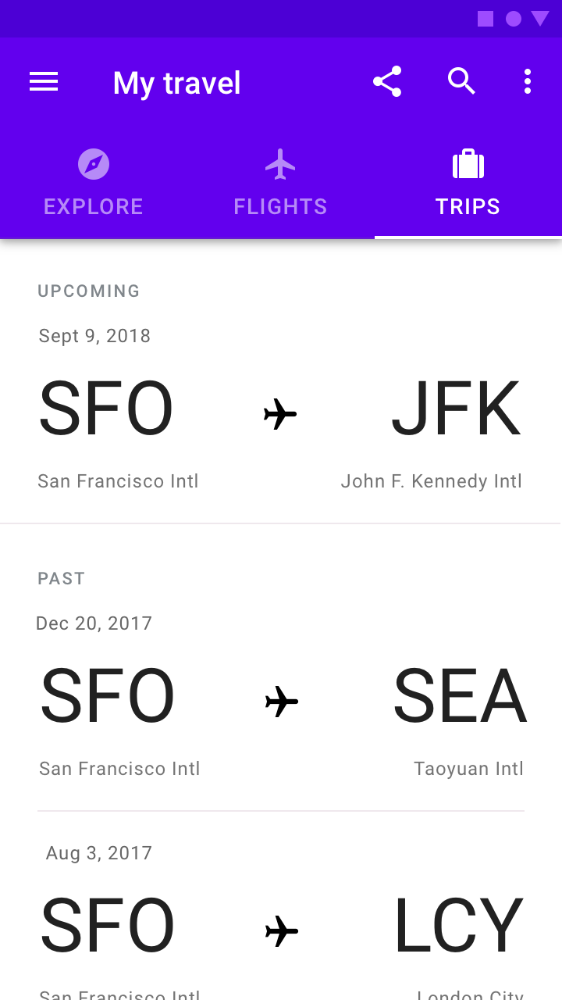
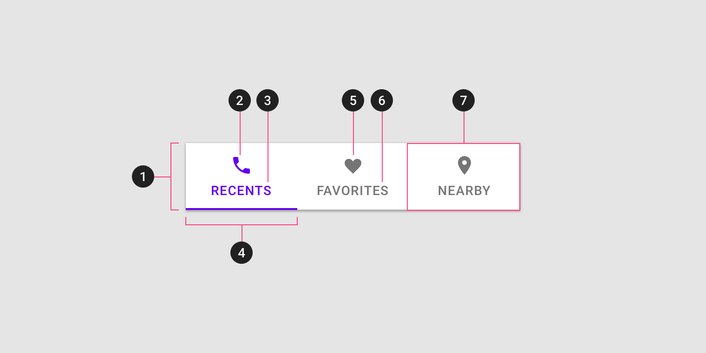

<!--docs:
title: "Tabs"
layout: detail
section: components
excerpt: "Android tabs."
iconId: tabs
path: /catalog/tabs/
-->

# Tabs

[Tabs](https://material.io/components/tabs/) organize content across different
screens, data sets, and other interactions.



**Contents**

*   [Design & API Documentation](#design-api-documentation)
*   [Using tabs](#using-tabs)
*   [Fixed tabs](#fixed-tabs)
*   [Scrollable tabs](#scrollable-tabs)
*   [Theming tabs](#theming-tabs)

## Design & API Documentation

*   [Google Material3 Spec](https://material.io/components/tabs/overview)
*   [API Reference](https://developer.android.com/reference/com/google/android/material/tabs/package-summary)

## Using tabs

Before you can use Material tabs, you need to add a dependency to the Material
Components for Android library. For more information, go to the
[Getting started](https://github.com/material-components/material-components-android/tree/master/docs/getting-started.md)
page.

### Basic usage


A
[`TabLayout`](https://github.com/material-components/material-components-android/tree/master/lib/java/com/google/android/material/tabs/TabLayout.java)
can be added to a layout:

```xml
<com.google.android.material.tabs.TabLayout
    android:layout_width="match_parent"
    android:layout_height="wrap_content">

    ...

</com.google.android.material.tabs.TabLayout>
```

[`TabItem`](https://github.com/material-components/material-components-android/tree/master/lib/java/com/google/android/material/tabs/TabItem.java)s
can then be added as children of the `TabLayout` and adjusted as needed:

```xml
<com.google.android.material.tabs.TabLayout
    ...>

    <com.google.android.material.tabs.TabItem
        android:layout_width="wrap_content"
        android:layout_height="wrap_content"
        android:text="@string/text_label_1"
        />

    <com.google.android.material.tabs.TabItem
        android:layout_width="wrap_content"
        android:layout_height="wrap_content"
        android:text="@string/text_label_2"
        />

    ...

</com.google.android.material.tabs.TabLayout>
```

Observe changes to tab selections:

```kt
tabLayout.addOnTabSelectedListener(object : TabLayout.OnTabSelectedListener {

    override fun onTabSelected(tab: TabLayout.Tab?) {
        // Handle tab select
    }

    override fun onTabReselected(tab: TabLayout.Tab?) {
        // Handle tab reselect
    }

    override fun onTabUnselected(tab: TabLayout.Tab?) {
        // Handle tab unselect
    }
})
```

API and source code:

*   `TabLayout`
    *   [Class definition](https://developer.android.com/reference/com/google/android/material/tabs/TabLayout)
    *   [Class source](https://github.com/material-components/material-components-android/tree/master/lib/java/com/google/android/material/tabs/TabLayout.java)
*   `TabItem`
    *   [Class definition](https://developer.android.com/reference/com/google/android/material/tabs/TabItem)
    *   [Class source](https://github.com/material-components/material-components-android/tree/master/lib/java/com/google/android/material/tabs/TabItem.java)

### Making tabs accessible

The Android tab components support screen reader descriptions for tabs and
badges. While optional, we strongly encourage their use.

#### Content descriptions

Adding a content description to the entire `TabLayout` can be done in XML with
the `android:contentDescription` attribute or programmatically:

```kt
tabLayout.contentDescription = contentDescription
```

Content descriptions can also be added to individual tabs:

```kt
val tab = tabLayout.getTabAt(index)
tab?.contentDescription = contentDescription
```

`BadgeDrawable` also has a number of content description setters for different
badge states:

```kt
val badge = tab.getOrCreateBadge()

// For badges with a number
badge.setContentDescriptionNumberless(contentDescription)
badge.setContentDescriptionQuantityStringsResource(R.string.content_description)
badge.setContentDescriptionExceedsMaxBadgeNumberStringResource(R.string.content_description)

// For badges with a text
badge.setContentDescriptionForText(contentDescription)
```

### Using tabs with ViewPager

A `TabLayout` can be set up with a
[`ViewPager`](https://developer.android.com/reference/androidx/viewpager/widget/ViewPager)
in order to:

*   Dynamically create `TabItem`s based on the number of pages, their titles,
    etc.
*   Synchronize the selected tab and tab indicator position with page swipes

First, your
[`PagerAdapter`](https://developer.android.com/reference/androidx/viewpager/widget/PagerAdapter)
(or subclass) needs to override the `getPageTitle` function in order to set the
tab text label:

```kt
class Adapter : PagerAdapter() {

    ...

    override fun getPageTitle(position: Int): CharSequence? {
        // Return tab text label for position
    }
}
```

After the adapter has been set on the `ViewPager`, synchronize the `TabLayout`:

```kt
tabLayout.setupWithViewPager(viewPager)
```

Further customization of the dynamically-created `TabItem`s (such as setting
icons) needs to be done separately:

```kt
val tab = tabLayout.getTabAt(index)
tab?.icon = drawable
```

### Using tabs with ViewPager2

Setting up a `TabLayout` with a
[`ViewPager2`](https://developer.android.com/reference/androidx/viewpager2/widget/ViewPager2)
relies on the same concepts as doing so with a `ViewPager`, but the
implementation is different. Everything is handled by the
[`TabLayoutMediator`](https://github.com/material-components/material-components-android/tree/master/lib/java/com/google/android/material/tabs/TabLayoutMediator.java)
class:

```kt
TabLayoutMediator(tabLayout, viewPager2) { tab, position ->
    when (position) {
        0 -> {
            tab.text = textLabel1
            tab.icon = drawable1
        }
        1 -> {
            tab.text = textLabel2
            tab.icon = drawable2
        }
        ...
    }
}.attach()
```

### Adding badges to tabs


Tabs support badging with the
[`BadgeDrawable`](https://github.com/material-components/material-components-android/tree/master/lib/java/com/google/android/material/badge/BadgeDrawable.java)
class:

```kt
// Get badge from tab (or create one if none exists)
val badge = tab.getOrCreateBadge()
// Customize badge
badge.number = number
// Remove badge from tab
tab.removeBadge()
```

### Types

There are two types of tabs: 1\. [Fixed tabs](#fixed-tabs), 2\.
[Scrollable tabs](#scrollable-tabs)


## Fixed tabs

Fixed tabs display all tabs on one screen, with each tab at a fixed width. The
width of each tab is determined by dividing the number of tabs by the screen
width. They don’t scroll to reveal more tabs; the visible tab set represents the
only tabs available.

### Fixed tabs example

The following example shows a row of fixed tabs.


In the layout:

```xml
<com.google.android.material.tabs.TabLayout
    android:layout_width="match_parent"
    android:layout_height="wrap_content"
    app:tabMode="fixed">

    <com.google.android.material.tabs.TabItem
        android:layout_width="wrap_content"
        android:layout_height="wrap_content"
        android:text="@string/tab_1"
        android:icon="@drawable/ic_favorite_24dp"
        />

    <com.google.android.material.tabs.TabItem
        android:layout_width="wrap_content"
        android:layout_height="wrap_content"
        android:text="@string/tab_2"
        android:icon="@drawable/ic_music_24dp"
        />

    <com.google.android.material.tabs.TabItem
        android:layout_width="wrap_content"
        android:layout_height="wrap_content"
        android:text="@string/tab_3"
        android:icon="@drawable/ic_search_24dp"
        />

</com.google.android.material.tabs.TabLayout>
```

## Scrollable tabs

Scrollable tabs are displayed without fixed widths. They are scrollable, such
that some tabs will remain off-screen until scrolled.

### Scrollable tabs example

The following example shows a row of scrollable tabs.


In the layout:

```xml
<com.google.android.material.tabs.TabLayout
    android:layout_width="match_parent"
    android:layout_height="wrap_content"
    app:tabMode="scrollable"
    app:tabContentStart="56dp">

    <com.google.android.material.tabs.TabItem
        android:layout_width="wrap_content"
        android:layout_height="wrap_content"
        android:text="@string/tab_1"
        />

    <com.google.android.material.tabs.TabItem
        android:layout_width="wrap_content"
        android:layout_height="wrap_content"
        android:text="@string/tab_2"
        />

    <com.google.android.material.tabs.TabItem
        android:layout_width="wrap_content"
        android:layout_height="wrap_content"
        android:text="@string/tab_3"
        />

    <com.google.android.material.tabs.TabItem
        android:layout_width="wrap_content"
        android:layout_height="wrap_content"
        android:text="@string/tab_4"
        />

    <com.google.android.material.tabs.TabItem
        android:layout_width="wrap_content"
        android:layout_height="wrap_content"
        android:text="@string/tab_5"
        />
    ...
</com.google.android.material.tabs.TabLayout>
```

### Anatomy and key properties

Tabs have a container and each tab item has an optional icon and text label. Tab
items can be in an active or inactive state. The tab indicator is shown below
the active tab item.



1.  Container
2.  Active icon (optional if there’s a label)
3.  Active text label (optional if there’s an icon)
4.  Active tab indicator
5.  Inactive icon (optional if there’s a label)
6.  Inactive text label (optional if there’s an icon)
7.  Tab item

### Container attributes

Element       | Attribute            | Related method(s)                  | Default value
------------- | -------------------- | ---------------------------------- | -------------
**Color**     | `android:background` | `setBackground`<br>`getBackground` | `?attr/colorOnSurfaceVariant`
**Elevation** | `android:elevation`  | `setElevation`                     | `0dp`
**Height**    | N/A                  | N/A                                | `48dp` (inline text) or `72dp` (non-inline text and icon)
**Tab mode**  | `tabMode`            | `setTabMode`<br>`getTabMode`       | `fixed`

### Tab item icon attributes

Element   | Attribute      | Related method(s)                                                | Default value
--------- | -------------- | ---------------------------------------------------------------- | -------------
**Icon**  | `android:icon` | `setIcon`<br>`getIcon`                                           | `null`
**Color** | `tabIconTint`  | `setTabIconTint`<br>`setTabIconTintResource`<br>`getTabIconTint` | `colorOnSurfaceVariant` and `colorPrimary` (activated) (see all [states](https://github.com/material-components/material-components-android/tree/master/lib/java/com/google/android/material/tabs/res/color/m3_tabs_icon_color.xml))

### Tab item text label attributes

Element                   | Attribute                   | Related method(s)                                               | Default value
------------------------- | --------------------------- | --------------------------------------------------------------- | -------------
**Text**                  | `android:text`              | `setText`<br>`getText`                                          | `null`
**Color**                 | `tabTextColor`              | `setTabTextColors`<br>`getTabTextColors`                        | `colorOnSurfaceVariant` and `colorPrimary` (activated) (see all [states](https://github.com/material-components/material-components-android/tree/master/lib/java/com/google/android/material/tabs/res/color/m3_tabs_icon_color.xml))
**Typography**            | `tabTextAppearance`         | N/A                                                             | `?attr/textAppearanceTitleSmall`
**Active tab typography** | `tabSelectedTextAppearance` | N/A                                                             | None; will use `tabTextAppearance` instead
**Inline label**          | `tabInlineLabel`            | `setInlineLabel`<br>`setInlineLabelResource`<br>`isInlineLabel` | `false`

**Note:** When using `tabSelectedTextAppearance`, you must have matching text
attributes in `tabTextAppearance` to avoid unintended behavior.

### Tab item container attributes

Element              | Attribute                                                                                     | Related method(s)                                                            | Default value
-------------------- | --------------------------------------------------------------------------------------------- | ---------------------------------------------------------------------------- | -------------
**Ripple color**     | `tabRippleColor`                                                                              | `setTabRippleColor`<br>`setTabRippleColorResource`<br>`getTabRippleColor`    | `colorOnSurfaceVariant` at 16% opacity and `colorPrimary` at 16% opacity (activated) (see all [states](https://github.com/material-components/material-components-android/tree/master/lib/java/com/google/android/material/tabs/res/color/m3_tabs_ripple_color.xml))
**Unbounded ripple** | `tabUnboundedRipple`                                                                          | `setUnboundedRipple`<br>`setUnboundedRippleResource`<br>`hasUnboundedRipple` | `true`
**Gravity**          | `tabGravity`                                                                                  | `setTabGravity`<br>`getTabGravity`                                           | `fill`
**Min width**        | `tabMinWidth`                                                                                 | N/A                                                                          | `72dp` (scrollable) or `wrap_content`
**Max width**        | `tabMaxWidth`                                                                                 | N/A                                                                          | `264dp`
**Padding**          | `tabPaddingStart`<br>`tabPaddingEnd`<br>`tabPaddingTop`<br>`tabPaddingBottom`<br>`tabPadding` | N/A                                                                          | `12dp`<br>`12dp`<br>`0dp`<br>`0dp`<br>`0dp`

### Tab indicator attributes

Element                | Attribute                       | Related method(s)                                                | Default value
---------------------- | ------------------------------- | ---------------------------------------------------------------- | -------------
**Color**              | `tabIndicatorColor`             | `setSelectedTabIndicatorColor`                                   | `colorPrimary`
**Drawable**           | `tabIndicator`                  | `setSelectedTabIndicator`<br>`getSelectedTabIndicator`           | [`m3_tabs_rounded_line_indicator`](https://github.com/material-components/material-components-android/tree/master/lib/java/com/google/android/material/tabs/res/drawable/m3_tabs_rounded_line_indicator.xml)
**Height**             | `tabIndicatorHeight`            | `setSelectedTabIndicatorHeight`                                  | `2dp`
**Full width**         | `tabIndicatorFullWidth`         | `setTabIndicatorFullWidth`<br>`isTabIndicatorFullWidth`          | `false`
**Animation mode**     | `tabIndicatorAnimationMode`     | `setTabIndicatorAnimationMode`<br>`getTabIndicatorAnimationMode` | `elastic`
**Gravity**            | `tabIndicatorGravity`           | `setSelectedTabIndicatorGravity`<br>`getTabIndicatorGravity`     | `bottom`
**Animation duration** | `tabIndicatorAnimationDuration` | N/A                                                              | `250`

### Styles

Element                            | Style
---------------------------------- | --------------------------------------
**Default style**                  | `Widget.Material3.TabLayout`
**Style for elevateable surfaces** | `Widget.Material3.TabLayout.OnSurface`
**Primary secondary color style**  | `Widget.Material3.TabLayout.Secondary`

Default style theme attribute: `?attr/tabStyle`

Additional style theme attributes: `?attr/tabSecondaryStyle`

See the full list of
[styles](https://github.com/material-components/material-components-android/tree/master/lib/java/com/google/android/material/tabs/res/values/styles.xml)
and
[attrs](https://github.com/material-components/material-components-android/tree/master/lib/java/com/google/android/material/tabs/res/values/attrs.xml).

## Theming tabs

Tabs support
[Material Theming](https://material.io/components/app-bars-bottom/#theming)
which can customize color and typography.

### Tabs theming example

API and source code:

*   `TabLayout`
    *   [Class definition](https://developer.android.com/reference/com/google/android/material/tabs/TabLayout)
    *   [Class source](https://github.com/material-components/material-components-android/tree/master/lib/java/com/google/android/material/tabs/TabLayout.java)
*   `TabItem`
    *   [Class definition](https://developer.android.com/reference/com/google/android/material/tabs/TabItem)
    *   [Class source](https://github.com/material-components/material-components-android/tree/master/lib/java/com/google/android/material/tabs/TabItem.java)

The following example shows a row of scrollable tabs with Material Theming.


#### Implementing tabs theming

Use theme attributes and styles in `res/values/styles.xml` which applies to all
tabs and affects other components:

```xml
<style name="Theme.App" parent="Theme.Material3.*">
    ...
    <item name="colorPrimary">@color/shrine_pink_900</item>
    <item name="colorSurface">@color/shrine_pink_light</item>
    <item name="colorOnSurface">@color/shrine_pink_900</item>
    <item name="textAppearanceLabelLarge">@style/TextAppearance.App.LabelLarge</item>
</style>

<style name="TextAppearance.App.LabelLarge" parent="TextAppearance.Material3.LabelLarge">
    <item name="fontFamily">@font/rubik</item>
    <item name="android:fontFamily">@font/rubik</item>
</style>
```

Use default style theme attributes, styles and theme overlays, which apply to
all tabs but do not affect other components:

```xml
<style name="Theme.App" parent="Theme.Material3.*">
    ...
    <item name="tabStyle">@style/Widget.App.LabelLarge</item>
</style>

<style name="Widget.App.TabLayout" parent="Widget.Material3.TabLayout">
    <item name="materialThemeOverlay">@style/ThemeOverlay.App.TabLayout</item>
    <item name="tabTextAppearance">@style/TextAppearance.App.LabelLarge</item>
</style>

<style name="ThemeOverlay.App.TabLayout" parent="">
    <item name="colorPrimary">@color/shrine_pink_900</item>
    <item name="colorSurface">@color/shrine_pink_light</item>
    <item name="colorOnSurface">@color/shrine_pink_900</item>
</style>
```

Use the style in the layout, which affects only these tabs:

```xml
<com.google.android.material.tabs.TabLayout
    ...
    style="@style/Widget.App.TabLayout"
    />
```
